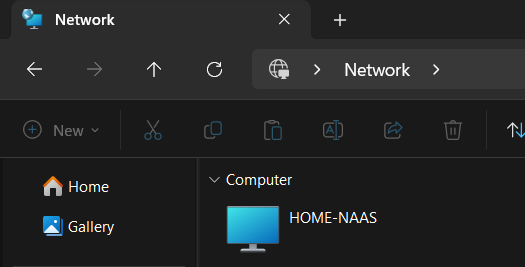

# Self Hosted Home NAS Server

## Overview

This project documents the setup of a self-hosted Network Attached Storage (NAS) system built using a repurposed laptop. The system provides centralized file storage within a home network and secure remote access without exposing services to the public internet.

The goal of this project was to create a reliable, low-cost storage solution while gaining hands-on experience with Linux systems, networking, and service configuration.

---

## Tech Stack

* OpenMediaVault (Debian-based NAS OS)
* Samba (SMB file sharing)
* Tailscale (VPN for secure remote access)
* Debian Linux (base system)

---

## Features

* Centralized file storage accessible across multiple devices
* Secure remote access using VPN (no port forwarding required)
* Local network file sharing via SMB
* Persistent storage with automatic mounting
* System remains accessible even when the laptop lid is closed
* Stable recovery after power outages

---

## Hardware

* e-waste old laptop used as a NAS server
* Internal storage drive
* Connected to home network (Wi-Fi)

---

## Setup Summary

1. Installed OpenMediaVault on the laptop
2. Configured and mounted storage disk
3. Created shared folders
4. Enabled SMB (Samba) file sharing
5. Installed and configured Tailscale
6. Verified both local and remote access

---

## Challenges and Solutions

**System not accessible immediately after power restoration**
The NAS required a few minutes to fully boot and initialize services. This was resolved by understanding the boot sequence and verifying that all services start correctly.

**SMB login issues on windows client devices**
Authentication problems were caused by cached credentials on the client machine. Clearing saved credentials resolved the issue.

---

## Security Considerations

* No port forwarding is used
* Remote access is handled through an encrypted VPN (Tailscale)
* Access is limited to devices within the local network or VPN
* Sensitive credentials are not exposed in this repository

---

## Screenshots

### OpenMediaVault Dashboard

### Local Network Access (Windows SMB)

### Remote Access via Tailscale (Mobile Data)

---

## Future Improvements

* Implement automated backups
* Add disk redundancy like RAID
* Monitoring and alerting 
* Switch to Ethernet for improved performance

---

## Learnings

* Linux system administration
* Network file sharing (SMB)
* VPN-based secure access
* Troubleshooting real-world infrastructure issues
* Handling system behavior after power interruptions

---
